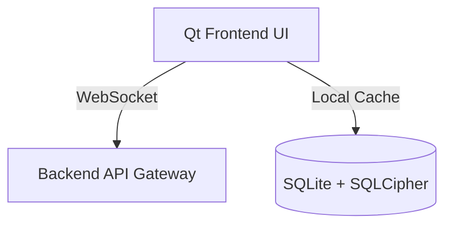

# 💻 Ventra-Messenger - Desktop-Client


[](https://opensource.org/licenses/MIT)


A modern, high-performance Qt-based desktop client for the **Ventra-Messenger** with end-to-end encryption and full self-hosting capability.  

## 🌟 Key Features
- **End-to-End Encryption**: Seamless integration with backend crypto layer (Double Ratchet, AES-256-GCM, X25519)  
- **Cross-Platform**: Native C++/Qt application for Windows, Linux, and macOS  
- **Local Secure Storage**: SQLite3 + SQLCipher for caching and offline usage  
- **Realtime Messaging**: Fast WebSocket communication with backend services  
- **Lightweight & Fast**: Optimized C++17 client with low memory footprint  



# 🧱 Technology Stack
### Component    Technologies
- **UI**:        Qt 6, QML, Widgets  
- **Language**:  C++17  
- **Storage**:   SQLite3 + SQLCipher  
- **Security**:  OpenSSL, Double Ratchet  
- **Realtime**:  WebSockets  

# 🚀 Local Installation
### Client
```bash
not ready
```

#### Requirements
- Qt 6+
- CMake + Ninja
- OpenSSL
- SQLite3 + SQLCipher

---

🔐 Combine with the backend for a fully secure & scalable messenger system.
